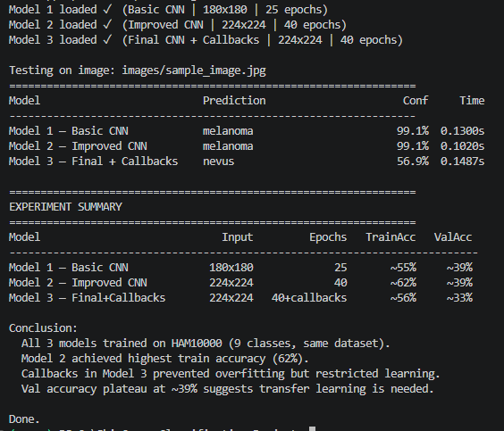

# Skin Cancer Classification using Convolutional Neural Networks (CNN)

## Overview

This project implements multiple Convolutional Neural Network (CNN) models for multiclass skin lesion classification using the HAM10000 dataset.

Three CNN models were trained and compared based on prediction accuracy, confidence score, and inference time.

---

## Features

- Skin lesion classification
- Comparison of three CNN models
- Confidence score prediction
- Inference time comparison
- Supports custom skin lesion images

---

## Dataset

This project uses the **HAM10000 (Human Against Machine with 10000 Training Images)** dataset.

Dataset Link:

https://www.kaggle.com/datasets/kmader/skin-cancer-mnist-ham10000

The dataset should contain the following class folders:

```
actinic keratosis
basal cell carcinoma
dermatofibroma
melanoma
nevus
pigmented benign keratosis
seborrheic keratosis
squamous cell carcinoma
vascular lesion
```

The dataset is **not included** in this repository because of its size.

---

## Project Structure

```
SkinCancerClassification_Project
│
├── images/
│   └── sample_image.jpg
│
├── models/
│   ├── skin_cancer_model.h5
│   ├── skin_cancer_model (1).h5
│   └── final_skin_cancer_model.keras
│
├── screenshots/
│   └── prediction_output.png
│
├── compare_models.py
├── requirements.txt
├── README.md
├── LICENSE
└── .gitignore
```

---

## Installation

Clone the repository

```bash
git clone https://github.com/YOUR_USERNAME/SkinCancerClassification_Project.git

cd SkinCancerClassification_Project
```

Create virtual environment

```bash
python -m venv .venv
```

Activate virtual environment

Windows

```bash
.venv\Scripts\activate
```

Install dependencies

```bash
pip install -r requirements.txt
```

---

## Running the Project

Place your test image inside

```
images/
```

Replace

```
sample_image.jpg
```

with your own image if desired.

Run

```bash
python compare_models.py
```

---

## Model Comparison

| Model | Input Size | Epochs | Training Accuracy | Validation Accuracy |
|--------|------------|---------|-------------------|---------------------|
| Basic CNN | 180×180 | 25 | ~55% | ~39% |
| Improved CNN | 224×224 | 40 | ~62% | ~39% |
| Final CNN + Callbacks | 224×224 | 40 | ~56% | ~33% |

---

## Example Output



---

## Technologies Used

- Python
- TensorFlow / Keras
- NumPy
- h5py
- Pillow
- Matplotlib
- Scikit-learn

---

## Future Improvements

- Transfer Learning (EfficientNet / MobileNet)
- Hyperparameter Optimization
- Model Explainability (Grad-CAM)
- Web Application using Flask or Streamlit
- Deployment on Cloud

---

## Author

**Vansh Jain**
